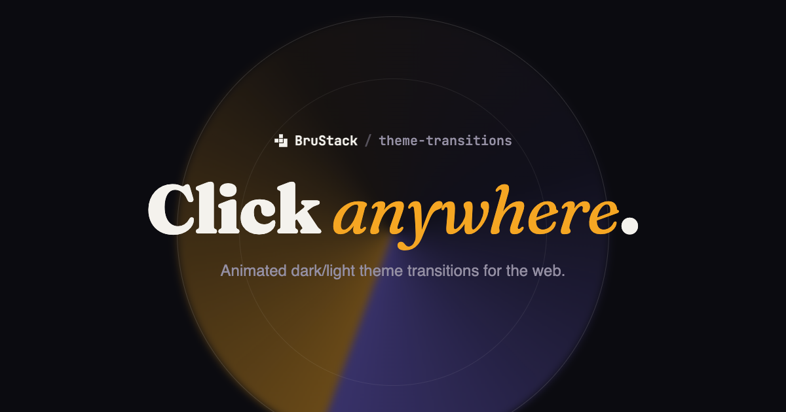

[](https://theme-transitions.brustack.dev)

# theme-transitions

[](LICENSE)


🌗 Animated dark/light theme transitions for the web, powered by the [View Transitions API](https://developer.mozilla.org/en-US/docs/Web/API/View_Transitions_API).

[Live demo](https://theme-transitions.brustack.dev) &middot; [Report a bug](https://github.com/brustack/theme-transitions/issues)


A framework-agnostic core with a thin adapter per framework. Vue, React, Nuxt, and Next.js are available today.

> [!NOTE]
> This is the **source monorepo**, for contributing to the packages themselves. If you just want to *use* one of them in your own project, jump straight to its README via the table below and `npm install` it normally. Don't clone this repo or copy a demo app out of it.

## Features

- Spread and fade transition effects, triggered from any click origin
- Automatic theme persistence and system-preference detection
- No flash of the wrong theme on page load
- Zero dependencies in the core; each adapter only depends on its own framework

## Packages

| Package | npm | Description |
| --- | --- | --- |
| [`@brustack/theme-transitions-core`](packages/core) | [](https://www.npmjs.com/package/@brustack/theme-transitions-core) | Framework-agnostic core: theme detection/persistence, View Transition orchestration, effect CSS generation. |
| [`@brustack/vue-theme-transitions`](packages/vue) | [](https://www.npmjs.com/package/@brustack/vue-theme-transitions) | Vue 3 composable built on the core. |
| [`@brustack/react-theme-transitions`](packages/react) | [](https://www.npmjs.com/package/@brustack/react-theme-transitions) | React hook built on the core. |
| [`@brustack/nuxt-theme-transitions`](packages/nuxt) | [](https://www.npmjs.com/package/@brustack/nuxt-theme-transitions) | Nuxt module built on the core. |
| [`@brustack/next-theme-transitions`](packages/next) | [](https://www.npmjs.com/package/@brustack/next-theme-transitions) | Next.js App Router hook and anti-flash script component built on the core. |

## Development

This section is for working on the packages themselves, not for using them. Run every command from the repo root. The demo apps (`apps/react-demo`, `apps/vue-demo`, `apps/showcase`) are npm workspaces symlinked to the local, in-progress source, not the published npm packages, so they only run correctly from inside this repo. They aren't standalone starter templates you can copy elsewhere.

Try a demo:

```
npm install
npm run dev:vue-demo
npm run dev:react-demo
npm run dev:showcase
```

Everything else:

| Command | Description |
| --- | --- |
| `npm test` | Run the test suite |
| `npm run lint` | Lint all packages |
| `npm run typecheck` | Type-check all packages |
| `npm run build` | Build all packages |

## License

[MIT License](LICENSE)

Copyright (c) 2026 Bruno Neckel
