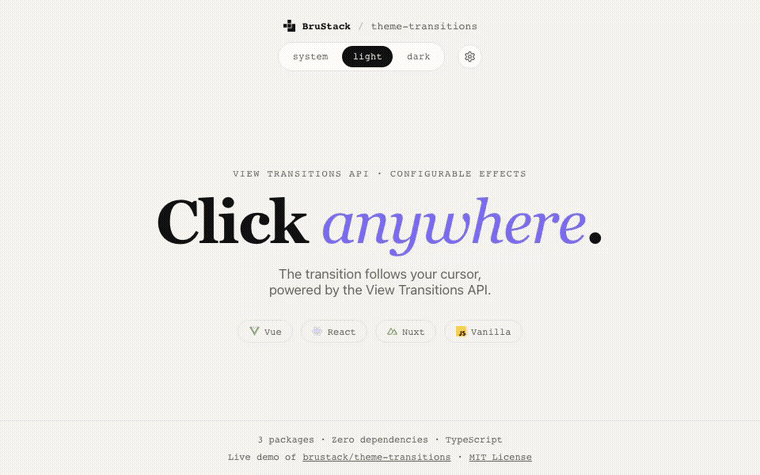

# @brustack/next-theme-transitions

[](https://www.npmjs.com/package/@brustack/next-theme-transitions)
[](https://github.com/brustack/theme-transitions/blob/main/packages/next/LICENSE)

Next.js App Router hook and anti-flash script component for animated dark/light theme transitions using the View Transitions API.

[Live demo](https://theme-transitions.brustack.dev)



## Install

```sh
npm install @brustack/next-theme-transitions @brustack/theme-transitions-core
# or
pnpm add @brustack/next-theme-transitions @brustack/theme-transitions-core
# or
yarn add @brustack/next-theme-transitions @brustack/theme-transitions-core
```

App Router only. Pages Router (`_app.tsx`/`_document.tsx`) isn't supported.

> [!IMPORTANT]
> Using Tailwind? Set `darkMode: 'class'` in your Tailwind config. Tailwind's default (`'media'`) ignores the `dark`/`light` class this package applies to `<html>`, so the toggle will silently have no visual effect without it.

## Usage

Add `ThemeScript` to your root layout's `<head>`. This is what prevents a flash of the wrong theme on load; it renders a plain inline `<script>` on the server, no client JavaScript required for this part:

```tsx
// app/layout.tsx
import { ThemeScript } from '@brustack/next-theme-transitions';
import '@brustack/theme-transitions-core/style.css';

export default function RootLayout({ children }: { children: React.ReactNode }) {
	return (
		<html lang="en" suppressHydrationWarning>
			<head>
				<ThemeScript variant="spread" duration="1.5s" />
			</head>
			<body>{children}</body>
		</html>
	);
}
```

Then use `useThemeTransition` from any Client Component:

```tsx
// app/components/theme-toggle.tsx
'use client';

import { useThemeTransition } from '@brustack/next-theme-transitions';

export const ThemeToggle = () => {
	const { theme, isAnimating, toggleTheme } = useThemeTransition({ variant: 'spread' });

	return (
		<button disabled={isAnimating} onClick={toggleTheme}>
			{theme}
		</button>
	);
};
```

Binding `toggleTheme` directly to `onClick` works because it accepts React's `MouseEvent` and derives the spread effect's origin from the click position automatically. The component calling the hook needs its own `'use client'` directive, same as any other interactive component in the App Router; `useThemeTransition` itself already has one, but that only makes the hook's *own* module client-safe, it doesn't make the component that calls it a Client Component.

## Options

Both `ThemeScript` and `useThemeTransition` accept the same shape. Pass matching options to both if you want the pre-hydration anti-flash script and the interactive hook to agree on defaults:

```ts
{
	variant?: 'spread' | 'fade' | 'none'; // default 'fade'
	duration?: string;                    // default '400ms' (fade) or '1.5s' (spread)
	easing?: string;                      // fade only, any CSS easing function, default 'ease'
}
```

`'none'` skips the animation and ignores `duration`/`easing`. `spread` only accepts `duration`; its easing and clip-path radius are fixed and not configurable.

`toggleTheme` and `setTheme(mode, ...)` accept a `MouseEvent` (as shown above) or an explicit options object, e.g. `{ origin, variant, duration }`. This overrides the hook's own options for that one call only. `setTheme('dark', event)` works the same way as `toggleTheme(event)`.

`options` passed to `useThemeTransition` only takes effect on the hook's first call in the app, since it wraps a shared singleton. Per-call overrides on `toggleTheme`/`setTheme` are not affected by this and always apply. See [`@brustack/theme-transitions-core`](https://www.npmjs.com/package/@brustack/theme-transitions-core)'s README for the full singleton contract.

## Notes

- This package has no Context/Provider. `useThemeTransition` reads from `getController()`'s external singleton directly (via `useSyncExternalStore`), the same way every other adapter in this project does, so there's nothing to wrap your app in beyond `ThemeScript` in `<head>`.
- App Router only. Next.js doesn't expose a way for a third-party package to inject into your root layout automatically the way a Vite plugin or a Nuxt module can, so `ThemeScript` has to be added explicitly, it can't be zero-config.
- `suppressHydrationWarning` on `<html>` is required because `ThemeScript`'s injected script sets a class on `<html>` before React hydrates. That's what prevents the flash, but it also means React sees an attribute it didn't render, so `suppressHydrationWarning` avoids a harmless but noisy console warning about that one attribute. This is the same tradeoff every anti-flash-script-based theme library makes, e.g. `next-themes`.

## Known issues

- Chrome 150 has a regression where the `spread` effect's clip-path animation can render from the wrong position after the browser window moves between displays with different DPI/scaling. This is a Chrome bug, not something this package can work around. It's already fixed upstream and verified in Chrome Canary; the fix should reach the Stable channel in a future release. See [Chromium issue #535696703](https://issues.chromium.org/issues/535696703).

## License

[MIT](LICENSE) © Bruno Neckel
